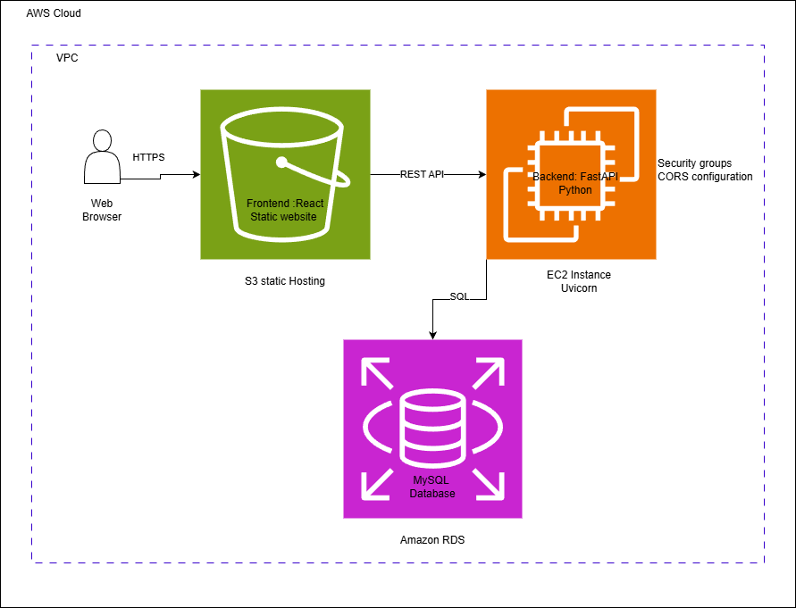

Empresa Logística

Empresa Logística es una aplicación web para la gestión de envíos, productos, bodegas y puertos. Permite crear órdenes de envío, consultar historial, con autenticación basada en JWT y roles.

📦 Tecnologías

Frontend: React, Axios, HTML y CSS

Backend: Python, FastAPI, SQLAlchemy, Pydantic

Base de datos: MySQL (desplegada en Railway)

Autenticación: JWT (JSON Web Tokens)

Despliegue:

Backend: Railway

Frontend: Vercel

Otros: Docker (para desarrollo), Postman (para pruebas de API)

Inicialmente, el proyecto se diseñó para desplegarse en AWS usando servicios como EC2, RDS y S3, pero para optimizar recursos, se hizo otra alternativa en la que el backend está en Railway y el frontend en Vercel.

🚀 Instalación y desarrollo local

1. Clona el repositorio:
cd EmpresaLogistica

2. Backend:

cd Backend
python -m venv venv
source venv/bin/activate    # Linux / macOS
venv\Scripts\activate       # Windows
pip install -r requirements.txt
uvicorn main:app --reload

3. Frontend:

cd ../frontend
npm install
npm start

swagger: https://empresalogistica-production.up.railway.app/docs
